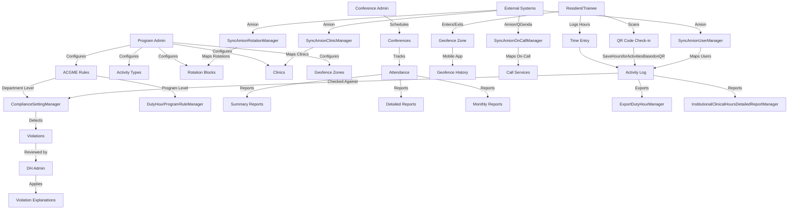

{/* Auto-generated by ai-enrich-dotnet.ts on 2026-02-20T16:00:00.000Z */}

## Architecture Overview

The **DutyHours** module is the platform's ACGME (Accreditation Council for Graduate Medical Education) compliance engine, responsible for tracking, validating, and reporting resident work hours across all programs. With **75 classes** and **22 Manager classes**, this is the largest and most complex business module in the MyEvaluations platform.

The module manages the complete duty hours lifecycle: activity configuration, time logging, rotation block scheduling, compliance rule enforcement, violation detection and review, geofencing for location-based time tracking, conference attendance tracking, and external scheduling system integration (Amion and QGenda). It also handles institutional-level reporting and data export.

Key architectural characteristics:
- **ACGME rule engine**: Configurable compliance rules per department and PGY level, including 80-hour weekly limits, 24+4 shift maximums, minimum rest periods, and moonlighting tracking
- **External system integration**: Four dedicated Sync managers handle bidirectional data mapping with Amion (on-call scheduling) and QGenda (physician scheduling) for users, rotations, clinics, and call services
- **Geofencing support**: Location-based check-in/check-out with geofence zone management and history tracking
- **Conference management**: Full conference lifecycle including scheduling, attendance tracking, presenter management, evaluation templates, and compliance reporting
- **Block-based time structure**: Rotation blocks define the academic calendar structure used for compliance calculations, milestone periods, and PGY-specific configurations
- **QR code integration**: Activity-based QR codes for rapid time logging at clinical sites
- **Group participant management**: User groups for conference attendance, duty hour reporting, and schedule management
- **Tangier integration**: Legacy SOAP-based web service integration for location/site data from the Tangier scheduling system

## Manager Classes

### ComplianceSettingManager
**Base Class:** Manager | **Responsibility:** ACGME compliance rule configuration

The regulatory compliance engine. Manages department-level ACGME rules, compliance settings, and calculation rules that drive violation detection.

**Key Operations:**
- `GetDepartmentComplianceSettings` -- Retrieves all compliance configuration for a department
- `GetDepartmentACGMERules` -- Fetches ACGME-specific rules (80-hour limits, shift maximums, etc.)
- `GetComplianceActivityCategorySettings` -- Activity category inclusions/exclusions for compliance calculation
- `RestoreGlobalComplianceSettings` / `CopyFromGloablComplianceSettings` / `RestoreToDefaultComplianceSettings` -- Compliance settings reset and inheritance operations
- `AddDepartmentComplianceSettings` / `DeleteDepartmentComplianceSettings` -- CRUD for department compliance config
- `UpdateDepartmentComplianceSettingsCalculationRule` -- Modifies how compliance is calculated
- `AddDepartmentACGMERule` / `VerifiedDepartmentACGMERule` -- Creates and verifies ACGME rule configurations
- `UpdateExcludedCategoryForPGY` -- Excludes specific activity categories from compliance calculation per PGY level
- `InsertConfigurationRulesSettingTypes` -- Seeds compliance rule type definitions

**Stored Procedures (13):** GetDepartmentComplianceSettings, GetDepartmentACGMERules, GetComplianceActivityCategorySettings, RestoreGlobalComplianceSettings, CopyFromGloablComplianceSettings, RestoreToDefaultComplianceSettings, AddDepartmentComplianceSettings, DeleteDepartmentComplianceSettings, UpdateDepartmentComplianceSettingsCalculationRule, AddDepartmentACGMERule, VerifiedDepartmentACGMERule, UpdateExcludedCategoryForPGY, InsertConfigurationRulesSettingTypes

### ViolationReviewManager
**Base Class:** Manager | **Responsibility:** Duty hour violation detection, review, and resolution

Manages the workflow when residents exceed ACGME duty hour limits. Violations are flagged automatically and require administrative review.

**Key Operations:**
- `GetViolationList` -- Retrieves pending and reviewed violations
- `UpdateViolation` / `UpdateViolations` -- Marks violations as reviewed with explanations
- `GetViolationDetails` -- Fetches detailed violation data for review
- `GetDutyHourViolationToReviewCount` -- Dashboard count of pending violations
- `CheckDutyHoursAdminUserDepartmets` -- Validates admin authorization for violation review
- `SaveUserViolationByAdminAfterSettingsChanged` -- Recalculates violations when compliance settings change
- `CheckDutyHourAdminUserExist` -- Verifies duty hour admin exists for a department

**Stored Procedures (8):** GetViolationList, UpdateViolation, UpdateViolations, GetViolationDetails, GetDutyHourViolationToReviewCount, CheckDutyHoursAdminUserDepartmets, SaveUserViolationByAdminAfterSettingsChanged, CheckDutyHourAdminUserExist

### ViolationExplanationManager
**Base Class:** Manager | **Responsibility:** Pre-defined violation explanation management

Maintains a library of reusable explanations that admins can attach to duty hour violations during review.

**Key Operations:**
- `GetDepartmentExplanations` / `GetDepartmentExplanations_New` -- Retrieves explanation library
- `GetDepartmentExplanationById` -- Fetches a specific explanation
- `DoesDepartmentExplanationExists` -- Uniqueness validation
- `AddDepartmentExplanation` / `UpdateDepartmentExplanation` / `DeleteDepartmentExplanation` -- CRUD operations

**Stored Procedures (7):** GetDepartmentExplanations, GetDepartmentExplanations_New, GetDepartmentExplanationById, DoesDepartmentExplanationExists, AddDepartmentExplanation, UpdateDepartmentExplanation, DeleteDepartmentExplanation

### ActivityManager
**Base Class:** Manager | **Responsibility:** Duty hour activity type configuration

Manages the types of activities residents can log time against (clinical work, education, research, moonlighting, etc.), including QR code-based logging.

**Key Operations:**
- `GetEnabledActivities` / `GetActivities` -- Retrieves active activity types
- `GetActivitiesByCategory` / `GetActivitiesByCategory_new` -- Category-filtered activity lists
- `GetEnabledDepartmentActivitiesByCategory` -- Department-scoped active activities
- `GetSettingsByCategory` / `GetActivityCategories` / `GetActivityCategorySettings` -- Category configuration
- `GetQRCodeDetailsforActivity` / `GetDepartmentQRCodes` / `GetDepartmentScannedQRCodes` -- QR code management for rapid time logging
- `SaveHoursforActivitiesBasedonQR` -- Saves time entries from QR code scans
- `AddDepartmentActivity` / `UpdateDepartmentActivity` / `DeleteDepartmentActivity` -- Activity CRUD
- `SetDepartmentActivityDisableFlag` / `RestoreDepartmentActivity` -- Soft delete and restore
- `DoesActivityNameExist` / `DoesActivityAbbreviationExist` -- Uniqueness validation
- `GetUCONNDepartments` -- Institution-specific department data (UConn customization)

**Stored Procedures (21):** GetEnabledActivities, GetActivities, GetActivitiesByCategory, GetActivitiesByCategory_new, GetEnabledDepartmentActivitiesByCategory, GetSettingsByCategory, GetUCONNDepartments, GetQRCodeDetailsforActivity, GetDepartmentQRCodes, GetDepartmentScannedQRCodes, GetActivityInfoByID, SaveHoursforActivitiesBasedonQR, GetActivityCategories, GetActivityCategorySettings, AddDepartmentActivity, UpdateDepartmentActivity, DeleteDepartmentActivity, SetDepartmentActivityDisableFlag, DoesActivityNameExist, DoesActivityAbbreviationExist, RestoreDepartmentActivity

### BlockManager
**Base Class:** Manager | **Responsibility:** Academic calendar rotation block management

Manages rotation blocks that define the academic calendar structure. Blocks are the foundation for compliance period calculations and milestone tracking.

**Key Operations:**
- `GetDepartmentRotationBlocks` -- Retrieves block calendar for a department
- `AddRotationBlock` / `DeleteDepartmentRotationBlocks` -- Block CRUD
- `AddMilestonePeriod` / `DeleteMilestonePeriod` / `GetMilestonePeriod` -- Milestone period management within blocks
- `GetBlockPeriodForPGY` -- PGY-specific block period retrieval
- `GetAcademicYearsForRotationBlocks` -- Academic year dropdown data
- `AddDefaultStartDayForDutyHoursByDepartment` -- Sets department default calendar start
- `CheckDHRotationBlockCalendarMapWithSetup` -- Validates block calendar consistency
- `ResetDepartmentDefaultCalendarRotationBlocks` -- Resets to default block configuration
- `usp_TraceUsersToRefreshTraineeSchedules` -- Triggers schedule refresh for affected trainees

**Stored Procedures (11):** usp_TraceUsersToRefreshTraineeSchedules, GetDepartmentRotationBlocks, AddRotationBlock, AddMilestonePeriod, DeleteMilestonePeriod, GetMilestonePeriod, DeleteDepartmentRotationBlocks, GetBlockPeriodForPGY, GetAcademicYearsForRotationBlocks, AddDefaultStartDayForDutyHoursByDepartment, CheckDHRotationBlockCalendarMapWithSetup, ResetDepartmentDefaultCalendarRotationBlocks

### ClinicManager
**Base Class:** Manager | **Responsibility:** Clinic location management for duty hours

Manages clinic definitions used in duty hour scheduling and time logging.

**Key Operations:**
- `GetDepartmentClinics` / `GetMyEvalsDepartmentClinics` -- Clinic list retrieval
- `GetDepartmentClinicsListByCriteria` -- Filtered clinic search
- `GetClinicInfoByID` -- Single clinic detail
- `AddDepartmentClinics` / `UpdateDepartmentClinics` -- Clinic CRUD
- `SetDepartmentClinicDisableFlag` / `DeleteDepartmentClinicInfo` -- Soft and hard delete
- `DoesClinicNameExist` -- Uniqueness validation

**Stored Procedures (9):** GetDepartmentClinics, GetMyEvalsDepartmentClinics, GetDepartmentClinicsListByCriteria, SetDepartmentClinicDisableFlag, DeleteDepartmentClinicInfo, GetClinicInfoByID, AddDepartmentClinics, UpdateDepartmentClinics, DoesClinicNameExist

### GeofenceNamesManager
**Base Class:** Manager | **Responsibility:** Geofence zone configuration

Manages named geofence zones (GPS boundaries) used for location-based check-in/check-out time tracking on the mobile app.

**Key Operations:**
- `GetDepartmentGeofenceNames` / `GetDepartmentGeofenceNames_New` -- Geofence zone list
- `SetDepartmentGeofenceStatus` -- Enable/disable geofence zones
- `DeleteDepartmentGeofenceName` / `AddDepartmentGeofenceNames` / `UpdateDepartmentGeofenceNames` -- CRUD
- `GetGeofenceNamesInfoByID` -- Single zone detail
- `GetDepartmentAddress` -- Department address for geofence center point

**Stored Procedures (8):** GetDepartmentGeofenceNames, GetDepartmentGeofenceNames_New, SetDepartmentGeofenceStatus, DeleteDepartmentGeofenceName, AddDepartmentGeofenceNames, UpdateDepartmentGeofenceNames, GetGeofenceNamesInfoByID, GetDepartmentAddress

### ReviewgeofenceHistoryManager
**Base Class:** Manager | **Responsibility:** Geofence check-in/check-out history review

Provides administrative review of geofence-based time tracking data.

**Key Operations:**
- `GetgeofenceHistory` -- Retrieves geofence event history for a department
- `GetUsergeofenceHistory` -- User-specific geofence history
- `GetEntriedExitLocDetails` -- Entry/exit location details for audit

**Stored Procedures (3):** GetgeofenceHistory, GetUsergeofenceHistory, GetEntriedExitLocDetails

### SyncAmionUserManager
**Base Class:** Manager | **Responsibility:** Amion/QGenda user synchronization

Maps users between MyEvaluations and external scheduling systems (Amion for on-call, QGenda for scheduling).

**Key Operations:**
- `GetSyncAmionUsers` -- Retrieves Amion user mapping candidates
- `AddMatchedUser` / `DeleteMatchedUser` -- Creates/removes user mappings
- `GetDataUsersToSyncOffline` / `GetQgendaDataUsersToSyncOffline` -- Offline sync data retrieval
- `GetAutoSyncDataUsersToSyncManuallyOffline` / `GetQGendaAutoSyncDataUsersToSyncManuallyOffline` -- Manual override for auto-sync failures

**Stored Procedures (7):** GetSyncAmionUsers, AddMatchedUser, DeleteMatchedUser, GetDataUsersToSyncOffline, GetQgendaDataUsersToSyncOffline, GetAutoSyncDataUsersToSyncManuallyOffline, GetQGendaAutoSyncDataUsersToSyncManuallyOffline

### SyncAmionRotationManager
**Base Class:** Manager | **Responsibility:** Amion/QGenda rotation synchronization

Maps rotation definitions between MyEvaluations and external scheduling systems.

**Stored Procedures (7):** GetSyncAmionRotations, GetSyncQGendaRotations, GetOnCallRotationsOffline, GetQgendaRotationsOffline, DeleteMatchedRotation, AddMatchedRotation, GetQueueListForTangierDataImport

### SyncAmionClinicManager
**Base Class:** Manager | **Responsibility:** Amion/QGenda clinic synchronization

Maps clinic definitions between MyEvaluations and external scheduling systems.

**Stored Procedures (6):** GetSyncAmionClinics, GetSyncQGendaClinics, GetOnCallClinicsOffline, GetQGendaClinicsOffline, AddMatchedClinic, DeleteMatchedClinic

### SyncAmionOnCallManager
**Base Class:** Manager | **Responsibility:** Amion/QGenda on-call service synchronization

Maps on-call services and integrates with Tangier location data for site matching.

**Stored Procedures (10):** GetSyncAmionCallServices, GetSyncQGendaCallServices, AddMatchedActivity, DeleteMatchedActivity, GetTangierLocationSites, GetDepartmentInfoByID, GetOnCallServicesList, GetOnCallCallsOffline, GetQGendaCallsOffline, GetLastUpdatedDatesForSchedules

### DutyHourProgramRuleManager
**Base Class:** Manager | **Responsibility:** Program-level ACGME rule configuration

Manages ACGME rules at the program level (vs. department level in ComplianceSettingManager), including moonlighting policies.

**Key Operations:**
- `GetProgramList` -- Retrieves programs for rule configuration
- `GetProgramACGMERules` -- Fetches program-level ACGME rules
- `IsMoonlightingEnable` -- Checks if moonlighting is allowed for a program
- `AddProgramACGMERule` / `UpdateProgramMoonlighting` -- Rule configuration
- `ApplyProgramDHRulesByCriteria` / `ApplyProgramDutyHoursRules` -- Bulk rule application

**Stored Procedures (7):** GetProgramList, GetProgramACGMERules, IsMoonlightingEnable, AddProgramACGMERule, UpdateProgramMoonlighting, ApplyProgramDHRulesByCriteria, ApplyProgramDutyHoursRules

### GroupParticipantsManager
**Base Class:** Manager | **Responsibility:** User group management for conferences and reporting

Manages participant groups used for conference attendance tracking and duty hour reporting.

**Stored Procedures (12):** GetGroupParticipantsListByCriteriaForAllUsers, GetGroupParticipantsInfoByGroupIDForAllUsers, UpdateGroupParticipantsInfo, DeleteGroupParticipantsInfo, GetUserTypeList, GetPreceptorsList, GetUsersListByType, AddGroupParticipants, CopyGroupparticipants, DoesGroupNameExist, DoesGroupNameCopyExist, GetGroupParticipantsListByCriteriaForAllUsersRestore, UpdateParticipantsListByCriteria

### AdminsManager
**Base Class:** Manager | **Responsibility:** Duty hours administrator management

Manages which users have administrative access to duty hours features per department.

**Stored Procedures (4):** GetDHAdmins, AddDHAdmin, DeleteDHAdmin, UpdateDHAdminNonSubmittersStatus

### SummaryConferenceTrackingReportManager
**Responsibility:** Summary-level conference attendance reporting

Generates aggregate conference attendance reports across departments and time periods.

**Stored Procedures (13):** GetConferenceListByCriteria, GetConferences, GetDataForSummaryConferenceTrackingReport, GetDataForSummaryConferenceTrackingReportNew, GetDataForSummaryConferencePresentersTrackingReport, GetSummaryConferenceReportCalculationData, GetSummaryConferenceReportConferenceData, GetSummaryConferenceReportConferenceScheduleData, GetSummaryConferenceReportRequiredConferenceDataForUser, GetSummaryConferenceReportCalculationDataForUser, GetTableDataForSummaryConferenceTrackingReport, UserID, Conferencestable

### DetailedConferenceTrackingReportManager
**Responsibility:** Detailed per-conference attendance reporting

Generates detailed conference tracking reports with individual attendance records.

**Stored Procedures (5):** GetConferenceListByCriteria, GetConferenceListForReports, GetCurrentAcademicYearStartDate, GetDataForConferenceTrackingReport, UserID

### MonthlyConferenceReportManager
**Responsibility:** Monthly conference schedule and attendance reporting

Generates monthly views of conference schedules with presenter information.

**Stored Procedures (4):** GetDataForMonthlyConferenceReport, GetConferencePresentersInfoWithComma, GetMonthlyConferenceScheduleReportDataForDate, UserID

### InstitutionalClinicalHoursDetailedReportManager
**Base Class:** Manager | **Responsibility:** Institutional-level clinical hours reporting

Generates cross-department clinical hours reports at the institutional level.

**Stored Procedures (2):** InstitutionalClinicalHoursDetailedReportInputs, GetInstitutionalDHDetailedReportData

### ExportDutyHourManager
**Base Class:** Manager | **Responsibility:** Bulk duty hour data export

Exports duty hour data for external analysis and ACGME reporting.

**Stored Procedures (1):** ExportDutyHours

### GuestManager
**Responsibility:** Conference guest presenter management

Manages external guest presenters for conferences.

**Stored Procedures (3):** AddGuestPresenters, UpdateGuestPresenters, GetConferenceGuestInfoByID

### FileUploadServiceManager
**Responsibility:** File upload handling for duty hours documents

Handles document uploads associated with duty hour records and conferences.

## Business Rules

- ACGME duty hour limits are configurable per department AND per program, with program rules able to override department defaults
- Compliance rules include: 80-hour weekly average, 24+4 hour shift maximum, minimum 8-hour rest between shifts, one day off per week, and moonlighting hour tracking
- Activity categories can be excluded from compliance calculations on a per-PGY basis (e.g., educational time may not count toward the 80-hour limit for certain levels)
- Compliance settings support three inheritance levels: global defaults, department overrides, and program overrides
- Violations are automatically detected when logged hours exceed ACGME limits and must be reviewed by a designated DH admin
- When compliance settings are changed, existing violations must be recalculated (`SaveUserViolationByAdminAfterSettingsChanged`)
- Violation explanations are pre-defined per department for consistent documentation
- Geofence zones define physical boundaries for location-based time tracking via the mobile app
- Activity names and abbreviations must be unique within a department
- Clinic names must be unique within a department
- Group participant names must be unique (with copy uniqueness also validated)
- Rotation blocks define the academic calendar and are validated for consistency with the duty hours setup
- Block changes trigger trainee schedule refreshes (`usp_TraceUsersToRefreshTraineeSchedules`)
- External system sync (Amion/QGenda) supports both automatic and manual matching for users, rotations, clinics, and on-call services
- Conference attendance tracking supports check-in settings via the `ICheckInSettings` interface
- QR code-based time logging allows rapid activity hour entry at clinical sites
- Moonlighting must be explicitly enabled at the program level before residents can log moonlighting hours
- Only designated DH admins can review violations; admin existence is validated before operations

## Data Flow

## Stored Procedure Analysis

| Stored Procedure | Manager | Business Purpose |
|-----------------|---------|-----------------|
| GetDepartmentComplianceSettings | ComplianceSettingManager | Loads all ACGME compliance rules for a department |
| GetDepartmentACGMERules | ComplianceSettingManager | Fetches specific ACGME rule thresholds |
| RestoreGlobalComplianceSettings | ComplianceSettingManager | Resets department to platform-wide defaults |
| UpdateExcludedCategoryForPGY | ComplianceSettingManager | Excludes activity types from compliance by PGY |
| GetViolationList | ViolationReviewManager | Lists duty hour violations pending review |
| UpdateViolation | ViolationReviewManager | Records admin review decision on a violation |
| GetDutyHourViolationToReviewCount | ViolationReviewManager | Dashboard violation count |
| SaveUserViolationByAdminAfterSettingsChanged | ViolationReviewManager | Recalculates violations after settings change |
| GetEnabledActivities | ActivityManager | Lists active activity types for time logging |
| SaveHoursforActivitiesBasedonQR | ActivityManager | Records time from QR code scans |
| GetQRCodeDetailsforActivity | ActivityManager | Retrieves QR code configuration |
| GetDepartmentRotationBlocks | BlockManager | Loads rotation block calendar |
| usp_TraceUsersToRefreshTraineeSchedules | BlockManager | Triggers schedule rebuild after block changes |
| CheckDHRotationBlockCalendarMapWithSetup | BlockManager | Validates block calendar consistency |
| GetDepartmentGeofenceNames | GeofenceNamesManager | Lists configured geofence zones |
| GetgeofenceHistory | ReviewgeofenceHistoryManager | Retrieves location tracking audit trail |
| GetSyncAmionUsers | SyncAmionUserManager | Loads Amion user mapping candidates |
| GetSyncQGendaRotations | SyncAmionRotationManager | Loads QGenda rotation mapping candidates |
| GetProgramACGMERules | DutyHourProgramRuleManager | Program-level ACGME rules |
| IsMoonlightingEnable | DutyHourProgramRuleManager | Moonlighting policy check |
| ExportDutyHours | ExportDutyHourManager | Bulk data export for ACGME reporting |
| GetDataForSummaryConferenceTrackingReport | SummaryConferenceTrackingReportManager | Aggregate conference attendance data |
| GetDataForConferenceTrackingReport | DetailedConferenceTrackingReportManager | Per-conference attendance detail |
| GetInstitutionalDHDetailedReportData | InstitutionalClinicalHoursDetailedReportManager | Cross-department hours report |

## Migration Considerations

- **Highest complexity module**: With 75 classes and 22 managers, this is the most complex module. Plan a phased migration spanning multiple sprints
- **ACGME compliance is non-negotiable**: The compliance calculation engine must produce identical results during and after migration. Extensive regression testing with production data snapshots is essential
- **Phase 1 -- Read-only operations**: Migrate reporting managers first (SummaryConferenceTrackingReportManager, DetailedConferenceTrackingReportManager, MonthlyConferenceReportManager, InstitutionalClinicalHoursDetailedReportManager). These have no write side effects
- **Phase 2 -- Configuration CRUD**: Migrate ActivityManager, ClinicManager, GeofenceNamesManager, ViolationExplanationManager, AdminsManager. These are self-contained CRUD operations with uniqueness validation
- **Phase 3 -- External integrations**: Migrate all four Sync managers (User, Rotation, Clinic, OnCall). Consider replacing the Tangier SOAP service with REST. Build comprehensive integration tests with Amion/QGenda mock data
- **Phase 4 -- Compliance engine**: Migrate ComplianceSettingManager, DutyHourProgramRuleManager, and ViolationReviewManager together. These form a tightly coupled subsystem
- **Phase 5 -- Block management**: Migrate BlockManager last, as it triggers cascading schedule refreshes that affect many subsystems
- **QR code system**: The `SaveHoursforActivitiesBasedonQR` flow needs mobile app coordination. Ensure the NestJS API endpoint maintains the same contract
- **Geofencing**: The geofence check-in/check-out system depends on mobile app GPS data. Map to NestJS with real-time event processing via BullMQ
- **Conference attendance**: The `ICheckInSettings` interface is shared between `ConferenceInfo` and `ConferenceScheduleInfo`. Preserve this contract in the NestJS domain model
- **Tangier SOAP deprecation**: `LocationMaintenance` uses a legacy SOAP web reference. This should be replaced with a REST client or deprecated if Tangier is no longer used
- **Stored procedure naming inconsistencies**: Note typos like `GetEntriedExitLocDetails` (should be "Entries"), `CopyFromGloablComplianceSettings` (should be "Global"), `GetgeofenceHistory` (inconsistent casing). Standardize naming in NestJS entities
- **Institution-specific customizations**: `GetUCONNDepartments` in ActivityManager indicates institution-specific logic. Extract these into a configurable strategy pattern in NestJS
- **UserID as stored procedure parameter**: Several managers reference `UserID` as a stored procedure call, suggesting it may be passed as a context parameter. Ensure NestJS services propagate user context correctly

## Key Classes Reference

| Class | Purpose | Key Methods |
|-------|---------|-------------|
| ComplianceSettingManager | ACGME compliance rule configuration | GetDepartmentACGMERules, AddDepartmentACGMERule, UpdateExcludedCategoryForPGY |
| ViolationReviewManager | Violation detection and admin review | GetViolationList, UpdateViolation, GetDutyHourViolationToReviewCount |
| ViolationExplanationManager | Pre-defined violation explanations | AddDepartmentExplanation, DoesDepartmentExplanationExists |
| ActivityManager | Activity type configuration and QR codes | GetEnabledActivities, SaveHoursforActivitiesBasedonQR, GetQRCodeDetailsforActivity |
| BlockManager | Rotation block calendar management | GetDepartmentRotationBlocks, AddRotationBlock, AddMilestonePeriod |
| ClinicManager | Clinic location management | GetDepartmentClinics, AddDepartmentClinics, DoesClinicNameExist |
| GeofenceNamesManager | Geofence zone configuration | GetDepartmentGeofenceNames, AddDepartmentGeofenceNames, GetDepartmentAddress |
| ReviewgeofenceHistoryManager | Geofence audit trail | GetgeofenceHistory, GetUsergeofenceHistory, GetEntriedExitLocDetails |
| DutyHourProgramRuleManager | Program-level ACGME rules | GetProgramACGMERules, IsMoonlightingEnable, ApplyProgramDutyHoursRules |
| SyncAmionUserManager | Amion/QGenda user sync | GetSyncAmionUsers, AddMatchedUser, GetDataUsersToSyncOffline |
| SyncAmionRotationManager | Amion/QGenda rotation sync | GetSyncAmionRotations, GetSyncQGendaRotations, AddMatchedRotation |
| SyncAmionClinicManager | Amion/QGenda clinic sync | GetSyncAmionClinics, GetSyncQGendaClinics, AddMatchedClinic |
| SyncAmionOnCallManager | Amion/QGenda on-call sync | GetSyncAmionCallServices, GetTangierLocationSites, AddMatchedActivity |
| GroupParticipantsManager | Conference/report user groups | AddGroupParticipants, CopyGroupparticipants, DoesGroupNameExist |
| AdminsManager | DH administrator management | GetDHAdmins, AddDHAdmin, UpdateDHAdminNonSubmittersStatus |
| SummaryConferenceTrackingReportManager | Aggregate conference reports | GetDataForSummaryConferenceTrackingReport, GetSummaryConferenceReportCalculationData |
| DetailedConferenceTrackingReportManager | Detailed conference reports | GetDataForConferenceTrackingReport, GetConferenceListForReports |
| MonthlyConferenceReportManager | Monthly conference reports | GetDataForMonthlyConferenceReport, GetConferencePresentersInfoWithComma |
| InstitutionalClinicalHoursDetailedReportManager | Institutional hours reports | GetInstitutionalDHDetailedReportData |
| ExportDutyHourManager | Bulk data export | ExportDutyHours |
| GuestManager | Guest presenter management | AddGuestPresenters, UpdateGuestPresenters |
| ComplianceSettingInfo | Compliance settings DTO | N/A (data carrier) |
| ViolationReviewInfo | Violation review DTO | N/A (data carrier) |
| ViolationExplanationInfo | Violation explanation DTO | N/A (data carrier) |
| ActivityInfo | Activity type DTO | N/A (data carrier) |
| ActivityCategoryInfo | Activity category DTO | N/A (data carrier) |
| BlockInfo | Rotation block DTO | N/A (data carrier) |
| ClinicInfo | Clinic DTO | N/A (data carrier) |
| GeofenceNamesInfo | Geofence zone DTO | N/A (data carrier) |
| RotationInfo | Rotation DTO | N/A (data carrier) |
| ConferenceInfo | Conference definition DTO (implements ICheckInSettings) | N/A (data carrier) |
| ConferenceScheduleInfo | Conference schedule DTO (implements ICheckInSettings) | N/A (data carrier) |
| DutyHourProgramRuleInfo | Program rule DTO | N/A (data carrier) |
| DHConstants | Module constants | N/A (static values) |
| QGendaInfo | QGenda integration DTO | N/A (data carrier) |
| AmionUserInfo | Amion user mapping DTO | N/A (data carrier) |
| AmionRotationInfo | Amion rotation mapping DTO | N/A (data carrier) |
| AmionClinicInfo | Amion clinic mapping DTO | N/A (data carrier) |
| AmionCallServiceInfo | Amion call service mapping DTO | N/A (data carrier) |
| ExportDutyHoursInfo | Export data DTO | N/A (data carrier) |
| ReportsDutyHoursInfo | Report data DTO | N/A (data carrier) |
| RotationDutyHoursInfo | Rotation hours report DTO | N/A (data carrier) |
| StaffingServiceClient | Amion SOAP service client proxy | GetStaff, GetRoles, GetAssignments |
| LocationMaintenance | Tangier SOAP service client proxy | MaintainLocations |

---

*This documentation was auto-generated from source code analysis. Last updated: 2026-02-20T16:00:00.000Z*
