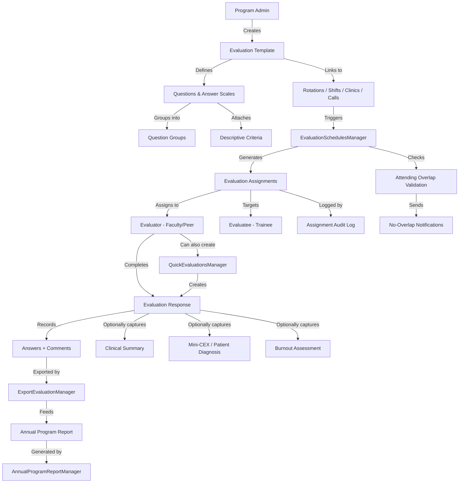

{/* Auto-generated by ai-enrich-dotnet.ts on 2026-02-20T16:00:00.000Z */}

## Architecture Overview

The **Evaluations** module is the foundational core of the MyEvaluations platform, responsible for the entire lifecycle of trainee and faculty evaluations across GME, CME, Nursing, and PA programs. This module manages evaluation form templates, question authoring, answer scales, evaluation scheduling and assignment, rotation-based evaluation triggers, clinical encounter summaries, burnout assessments, quick (ad-hoc) evaluations, patient diagnosis logging, and data export.

With **43 classes** and **10 Manager classes**, the module follows the standard Manager/Info pattern. Manager classes encapsulate all business logic and orchestrate SQL Server stored procedure calls through a DataAccess layer, while Info classes serve as DTOs carrying data between layers. The module integrates tightly with the Scheduling, Rotations, and Users modules to determine who evaluates whom, when, and using which template.

Key architectural characteristics:
- **Template-driven design**: Evaluation forms are built from reusable templates (`EvaluationsTemplateInfo`) containing questions, answer scales, and descriptive criteria
- **Rotation-linked scheduling**: Evaluations are automatically generated based on rotation assignments, academic year blocks, shifts, clinics, and call schedules
- **Multi-audience support**: Evaluations can target different user types (residents, faculty, nurses, PAs) with audience-specific templates
- **PGY-level specificity**: Templates and rotation linkages can be configured per PGY (Post-Graduate Year) level
- **Annual program reporting**: Supports ACGME Annual Program Evaluation through demographic and archival data aggregation

## Manager Classes

### EvaluationSchedulesManager
**Base Class:** Manager | **Responsibility:** Core scheduling engine for evaluation generation and assignment

This is the most critical manager in the module. It generates evaluation schedules based on rotation assignments and manages the full lifecycle of evaluation assignments across academic years.

**Key Operations:**
- `GenerateEvaluationSchedules` -- Bulk-creates evaluation assignments based on rotation/shift/clinic/call schedules
- `GetEvaluationSchedules` -- Retrieves scheduled evaluations for review and management
- `GetLogOfEvaluationAssignments` / `GetLogEvaluationAssignments` -- Audit trail for evaluation assignment changes
- `SendNoAttendingOverlapNotifications` -- Alerts when attending physician schedules do not overlap with trainee rotations
- `GetRotationNames` / `GetRotationNamesNew` -- Retrieves rotation names for schedule configuration
- `GetRotationsByAcademicYear` / `GetRotationsByAcademicYearNew` -- Fetches rotation data scoped to academic year
- `GetShiftsByAcademicYear` / `GetClinicsByAcademicYear` / `GetCallsByAcademicYear` -- Retrieves shift, clinic, and call schedule data
- `GetEvaluationsByRotation` / `GetEvaluationsByShift` / `GetEvaluationsByCalls` / `GetEvaluationsByClinics` -- Queries evaluations by schedule type
- `GetAudienceAndSubject` -- Determines evaluator-evaluatee relationships

**Stored Procedures (17):** GenerateEvaluationSchedules, GetEvaluationSchedules, GetLogOfEvaluationAssignments, GetLogEvaluationAssignments, SendNoAttendingOverlapNotifications, GetRotationNames, GetRotationNamesNew, GetRotationsByAcademicYear, GetShiftsByAcademicYear, GetClinicsByAcademicYear, GetCallsByAcademicYear, GetRotationsByAcademicYearNew, GetEvaluationsByRotation, GetEvaluationsByShift, GetEvaluationsByCalls, GetEvaluationsByClinics, GetAudienceAndSubject

### EvaluationsRotationsManager
**Base Class:** Manager | **Responsibility:** Links evaluation templates to rotations

Manages the mapping between evaluation templates and clinical rotations, including PGY-specific configurations and gap day handling.

**Key Operations:**
- `GetRotationPrimaryActivityTypes` -- Retrieves activity types for rotation classification
- `GetRotationGapDays` -- Identifies gap days between rotation blocks
- `GetFieldsForLinkRotationTemplate` / `GetFieldsForLinkRotationTemplateIsPGYSpcific` -- Retrieves configuration fields for template-rotation linkage
- `DeleteTemplateRotation` / `AddTemplateRotation` / `AddTemplateRotationIsPGYSpecific` -- CRUD for template-rotation associations
- `GetDistinctTemplateRotationInfo` -- Retrieves unique template-rotation combinations

**Stored Procedures (8):** GetRotationPrimaryActivityTypes, GetRotationGapDays, GetFieldsForLinkRotationTemplate, GetFieldsForLinkRotationTemplateIsPGYSpcific, DeleteTemplateRotation, AddTemplateRotation, AddTemplateRotationIsPGYSpecific, GetDistinctTemplateRotationInfo

### QuickEvaluationsManager
**Base Class:** Manager | **Responsibility:** Ad-hoc evaluation creation outside the scheduled workflow

Enables faculty to create evaluations on-the-fly for specific encounters, bypassing the normal scheduling engine.

**Key Operations:**
- `GetUserTypesForEvaluations` -- Retrieves eligible user types for quick evaluations
- `GetQuickEvaluationByDepartment` / `GetQuickEvaulationByUserType` -- Fetches existing quick evaluations by scope
- `GetUserScheduledRotations` -- Gets current rotation context for the evaluator
- `AddQuickEvaluation` / `UpdateQuickEvaluation` -- Creates and modifies ad-hoc evaluations

**Stored Procedures (6):** GetUserTypesForEvaluations, GetQuickEvaluationByDepartment, GetQuickEvaulationByUserType, GetUserScheduledRotations, AddQuickEvaluation, UpdateQuickEvaluation

### DescriptiveCriteriaManager
**Base Class:** Manager | **Responsibility:** Manages descriptive (rubric-style) criteria for evaluation questions

Handles the creation and management of descriptive criteria that define competency levels (e.g., "Meets Expectations", "Exceeds Expectations") with narrative descriptions.

**Key Operations:**
- `GetCriteriaList` / `GetCriteriaDetailsByCriterionID` -- Retrieves criteria definitions
- `AddCriteria` / `UpdateCriteria` / `DeleteCriteria` -- CRUD operations
- `DoesCriteriaExists` -- Duplicate prevention validation

**Stored Procedures (6):** GetCriteriaList, GetCriteriaDetailsByCriterionID, AddCriteria, DeleteCriteria, UpdateCriteria, DoesCriteriaExists

### ClinicalSummaryManager
**Base Class:** Manager | **Responsibility:** Clinical encounter documentation

Manages clinical task summaries, information sources, teaching points, and evidence-based medicine (EBM) assessments tied to patient encounters.

**Key Operations:**
- `GetClinicalTasks` -- Retrieves clinical task types
- `GetInformationSource` -- Gets information source options for encounter documentation
- `GetMainTeachingPoints` -- Retrieves teaching point categories
- `GetEBMor` / `GetEBMee` -- Evidence-Based Medicine data for evaluators and evaluatees

**Stored Procedures (5):** GetClinicalTasks, GetInformationSource, GetMainTeachingPoints, GetEBMor, GetEBMee

### PatientProblemDiagnosisManager
**Base Class:** Manager | **Responsibility:** Patient encounter demographics and diagnosis logging

Supports Mini-CEX (Mini Clinical Evaluation Exercise) assessments by managing patient demographics, exam complexity, and diagnostic data.

**Key Operations:**
- `GetPatientAgeList` / `GetPatientDemographicTypeList` / `GetPatientDemographicSettingList` -- Patient demographic dropdowns
- `GetExamComplexityList` / `GetMinutesList` -- Encounter configuration options
- `GetPatientProblemFocusList` / `GetGenderList` -- Additional demographic filters
- `GetMCXInfo` / `AddMCXInfo` -- Retrieve and save Mini-CEX assessment data

**Stored Procedures (9):** GetPatientAgeList, GetPatientDemographicTypeList, GetPatientDemographicSettingList, GetExamComplexityList, GetMinutesList, GetPatientProblemFocusList, GetGenderList, GetMCXInfo, AddMCXInfo

### QuestionGroupManager
**Base Class:** Manager | **Responsibility:** Question library organization

Manages reusable question groups that can be shared across evaluation templates.

**Key Operations:**
- `GetListOfQuestionGroups` / `GetListOfQuestionsByGroupId` -- Retrieves groups and their questions
- `AddQuestionGroup` / `DeleteQuestionGroup` -- Group lifecycle management
- `DoesQuestionGroupNameExists` -- Duplicate name prevention
- `GetListOfQuestionsByAudienceId` -- Audience-scoped question retrieval
- `AddQuestionToGroup` / `DeleteQuestionFromGroup` -- Question-group association management

**Stored Procedures (8):** GetListOfQuestionGroups, DeleteQuestionGroup, DoesQuestionGroupNameExists, AddQuestionGroup, GetListOfQuestionsByGroupId, DeleteQuestionFromGroup, GetListOfQuestionsByAudienceId, AddQuestionToGroup

### ExportEvaluationManager
**Base Class:** Manager | **Responsibility:** Evaluation data export

Handles bulk data export of completed evaluations for reporting and analysis.

**Stored Procedures (2):** GetDataForEvaluationExport, GetDataForEvaluationExport1

### AnnualProgramReportManager
**Responsibility:** Annual Program Evaluation (APE) report generation

Aggregates trainee demographics, department info, and archival flags for ACGME annual program evaluation reports.

**Stored Procedures (4):** GetDepartmentInfo, GetGeneralDemographicsInfoByUserID, GetUserInfoByDepartmentID, GetFlagArchivedDetailsByUserID

### AnswerManager
**Responsibility:** Answer processing and persistence

Handles the storage and retrieval of evaluation responses. While no stored procedures are currently detected in the metadata (likely handled through the base Manager class or inline SQL), this class works in tandem with `AnswerInfo` as its DTO counterpart.

## Business Rules

- Evaluations are automatically generated when rotation schedules are published, linking evaluators to evaluatees based on schedule overlap
- Each evaluation template can be linked to specific rotations, and these linkages can be PGY-specific (different forms for PGY-1 vs PGY-3)
- Quick evaluations allow faculty to create ad-hoc evaluations outside the scheduled workflow, but still require rotation context
- Descriptive criteria names must be unique within their scope (enforced by `DoesCriteriaExists` validation)
- Question group names must be unique (enforced by `DoesQuestionGroupNameExists` validation)
- Evaluation assignments generate audit logs tracking who was assigned, when, and any changes
- No-attending-overlap notifications are sent when rotation schedules do not have matching faculty coverage
- Clinical summaries capture evidence-based medicine (EBM) data for both evaluators and evaluatees separately
- Mini-CEX assessments require patient demographic data including age, gender, problem focus, exam complexity, and encounter duration
- Evaluation export supports multiple export formats (indicated by `GetDataForEvaluationExport` and `GetDataForEvaluationExport1` variants)
- Annual program reports aggregate demographic and archival data per department for ACGME compliance
- Evaluations span four schedule types: rotations, shifts, clinics, and calls -- each with dedicated query paths
- Burnout assessment data (`BurnOutInfo`, `EvaluationBurnOut`) is captured as part of the evaluation workflow

## Data Flow

## Stored Procedure Analysis

| Stored Procedure | Manager | Business Purpose |
|-----------------|---------|-----------------|
| GenerateEvaluationSchedules | EvaluationSchedulesManager | Bulk-creates evaluation assignments from rotation schedules |
| GetEvaluationSchedules | EvaluationSchedulesManager | Retrieves evaluation schedule list for admin review |
| GetLogOfEvaluationAssignments | EvaluationSchedulesManager | Audit trail of evaluation assignment history |
| SendNoAttendingOverlapNotifications | EvaluationSchedulesManager | Sends alerts when faculty schedules have gaps |
| GetRotationsByAcademicYear | EvaluationSchedulesManager | Fetches rotation data scoped to a specific academic year |
| GetEvaluationsByRotation | EvaluationSchedulesManager | Queries evaluations linked to a specific rotation |
| GetEvaluationsByShift | EvaluationSchedulesManager | Queries evaluations linked to a specific shift |
| GetEvaluationsByClinics | EvaluationSchedulesManager | Queries evaluations linked to a specific clinic |
| GetEvaluationsByCalls | EvaluationSchedulesManager | Queries evaluations linked to a specific call schedule |
| GetAudienceAndSubject | EvaluationSchedulesManager | Determines evaluator-evaluatee role pairing |
| GetRotationPrimaryActivityTypes | EvaluationsRotationsManager | Classifies rotation activity types |
| GetRotationGapDays | EvaluationsRotationsManager | Identifies gaps between rotation block boundaries |
| AddTemplateRotation | EvaluationsRotationsManager | Links an evaluation template to a rotation |
| AddTemplateRotationIsPGYSpecific | EvaluationsRotationsManager | Links template to rotation with PGY-level specificity |
| GetCriteriaList | DescriptiveCriteriaManager | Retrieves all descriptive criteria for rubric display |
| AddCriteria | DescriptiveCriteriaManager | Creates new rubric/descriptive criterion |
| DoesCriteriaExists | DescriptiveCriteriaManager | Validates uniqueness before criterion creation |
| GetClinicalTasks | ClinicalSummaryManager | Retrieves clinical task type options |
| GetEBMor / GetEBMee | ClinicalSummaryManager | Evidence-based medicine data for evaluator/evaluatee |
| GetPatientAgeList | PatientProblemDiagnosisManager | Patient age category dropdown data |
| GetMCXInfo / AddMCXInfo | PatientProblemDiagnosisManager | Retrieve and save Mini-CEX assessment data |
| GetListOfQuestionGroups | QuestionGroupManager | Retrieves reusable question group library |
| AddQuickEvaluation | QuickEvaluationsManager | Creates an ad-hoc evaluation record |
| GetDataForEvaluationExport | ExportEvaluationManager | Bulk export of completed evaluation data |
| GetDepartmentInfo | AnnualProgramReportManager | Department data for APE reports |
| GetGeneralDemographicsInfoByUserID | AnnualProgramReportManager | Trainee demographics for program reporting |

## Migration Considerations

- **High complexity, high risk**: This is the core module of the platform. Migration should be incremental, starting with read-only endpoints (exports, reports) before touching evaluation creation/scheduling
- **EvaluationSchedulesManager is the critical path**: With 17 stored procedures and the schedule generation engine, this manager should be migrated last or in a dedicated phase. Consider running both .NET and NestJS versions in parallel during transition
- **Template-rotation linkage**: The PGY-specific template-rotation binding logic is complex and must be thoroughly tested. Consider extracting this into a dedicated NestJS service with comprehensive unit tests
- **Question groups and criteria**: These are relatively self-contained CRUD operations and good candidates for early migration. They have minimal cross-module dependencies
- **Clinical summaries and Mini-CEX**: These features have healthcare-specific validation (EBM scoring, patient demographics) that must be preserved exactly during migration
- **Quick evaluations**: The ad-hoc workflow depends on active rotation context (`GetUserScheduledRotations`), creating a dependency on the scheduling module
- **Audit logging**: The evaluation assignment log (`GetLogOfEvaluationAssignments`) must be preserved or replaced with equivalent NestJS audit middleware
- **Dual stored procedure variants**: Several procedures have "New" variants (e.g., `GetRotationNamesNew`, `GetRotationsByAcademicYearNew`), suggesting incremental schema evolution. The NestJS migration should target only the latest variants
- **Burnout assessment**: The `BurnOutInfo` and `EvaluationBurnOut` classes indicate wellness tracking that may have regulatory reporting requirements
- **Export compatibility**: `ExportEvaluationManager` likely generates specific file formats. Ensure the NestJS replacement produces byte-identical output during the transition period
- **Notification system**: `SendNoAttendingOverlapNotifications` integrates with the platform's notification infrastructure. Map this to NestJS BullMQ workers for async processing

## Key Classes Reference

| Class | Purpose | Key Methods |
|-------|---------|-------------|
| EvaluationSchedulesManager | Core evaluation scheduling engine | GenerateEvaluationSchedules, GetEvaluationsByRotation, GetAudienceAndSubject |
| EvaluationsRotationsManager | Template-rotation linkage management | AddTemplateRotation, AddTemplateRotationIsPGYSpecific, GetRotationGapDays |
| QuickEvaluationsManager | Ad-hoc evaluation creation | AddQuickEvaluation, UpdateQuickEvaluation, GetUserScheduledRotations |
| DescriptiveCriteriaManager | Rubric/criteria management | AddCriteria, UpdateCriteria, DoesCriteriaExists |
| ClinicalSummaryManager | Clinical encounter documentation | GetClinicalTasks, GetEBMor, GetEBMee |
| PatientProblemDiagnosisManager | Mini-CEX patient data management | GetMCXInfo, AddMCXInfo, GetExamComplexityList |
| QuestionGroupManager | Reusable question library | AddQuestionGroup, AddQuestionToGroup, GetListOfQuestionsByGroupId |
| ExportEvaluationManager | Bulk evaluation data export | GetDataForEvaluationExport |
| AnnualProgramReportManager | APE report generation | GetDepartmentInfo, GetGeneralDemographicsInfoByUserID |
| EvaluationsInfo | Primary evaluation DTO | N/A (data carrier) |
| EvaluationsTemplateInfo | Evaluation template DTO | N/A (data carrier) |
| EvaluateInfo | Evaluation submission container | N/A (contains EvaluationAnswers, EvaluationCriterions, EvaluationBurnOut) |
| AnswerInfo | Evaluation answer DTO | N/A (data carrier) |
| AnswerScaleInfo | Answer scale configuration DTO | N/A (data carrier) |
| QuestionInfo | Evaluation question DTO | N/A (data carrier) |
| QuickEvaluationInfo | Quick evaluation DTO | N/A (data carrier) |
| BurnOutInfo | Burnout assessment DTO | N/A (data carrier) |
| ClinicalSummaryInfo | Clinical encounter DTO | N/A (data carrier) |
| PatientProblemDiagnosisInfo | Mini-CEX patient data DTO | N/A (data carrier) |
| EvaluationScheduleInfo | Schedule assignment DTO | N/A (data carrier) |
| SchedulerInformation | Scheduling context DTO | N/A (data carrier) |
| UserInformation | User context DTO for evaluations | N/A (data carrier) |
| AnnualProgramEvaluationSettings | APE configuration settings | N/A (configuration carrier) |
| FavoriteSettingsInfo | User evaluation preferences | N/A (data carrier) |
| EvaluationSearchCriteria | Search filter DTO for evaluations | N/A (search criteria) |
| EvaluationsTemplateSearchCriteria | Search filter DTO for templates | N/A (search criteria) |
| ContactSearchCriteria | Search filter DTO for contacts | N/A (search criteria) |
| EvaluationAssignmentUsersInfoLog | Audit log entry DTO | N/A (audit record) |

---

*This documentation was auto-generated from source code analysis. Last updated: 2026-02-20T16:00:00.000Z*
