{/* Auto-generated by ai-enrich-dotnet.ts on 2026-02-20T00:00:00.000Z */}

## Architecture Overview

The `MyEvaluations.Business.Security` module is the foundational security and identity layer of the MyEvaluations platform -- a healthcare education management system serving 10,000+ users across 900+ institutions for GME (Graduate Medical Education), CME, Nursing, and PA programs. With **119 classes** (including **23 Manager classes**), this module is the single largest business-layer assembly and touches virtually every aspect of the platform.

The module implements a classic **Manager/Info pattern**: Manager classes encapsulate business logic and orchestrate SQL Server stored procedure calls, while Info classes serve as Data Transfer Objects (DTOs) that carry data between layers. All database access is mediated through stored procedures -- there is no raw SQL or ORM usage. This pattern is consistent across the entire .NET 4.6.1 WebForms backend.

### Functional Domains

The Security module spans seven major functional domains:

1. **Authentication and Multi-Factor Authentication (MFA)** -- Login verification, password encryption, multi-factor auth via email and SMS, auth code generation/verification, and user impersonation.

2. **Authorization and Role-Based Access Control (RBAC)** -- Role definitions, privilege assignments, sub-module permissions, feature flags per user and department, and menu visibility control.

3. **User Management** -- User profiles, user search, user merging, demographics reporting, extended user info, login history, and email management.

4. **Institutional Hierarchy** -- Institutions, departments, department groups, institution-level department groups, training types, time zones, sub-specialities, and GME/IGA administrative structures.

5. **Onboarding (OBC)** -- Custom fields, custom forms, requirement groups, document types, onboarding group participants, lookup items, and managed fields with institution-level configurability.

6. **Certificates and Credentials** -- Certificate templates, user certificate assignments, certificate signatures, preceptor management, speciality templates, exam tracking, and training agreements.

7. **Operational Support** -- Audit trails, access history, service messages, build schedules, curriculum management, UIC (Unit Identification Code) management, New Relic logging, encryption utilities, and application settings.

### Class Distribution

| Category | Count | Examples |
|----------|-------|---------|
| Manager classes (business logic) | 23 | `RoleManager`, `FeatureManager`, `UserManager` |
| Info/DTO classes | ~55 | `RoleInfo`, `InstitutionInfo`, `LoginUserInfo` |
| SearchCriteria classes | 8 | `UserSearchCriteria`, `RoleSearchCriteria` |
| Authentication services | 5 | `AuthFactorService`, `EmailFactorService`, `SmsFactorService` |
| Utility/Infrastructure | ~10 | `PasswordEncryptor`, `EncryptValue`, `Utility` |
| Business helper classes | ~18 | `AccessHistoryBusiness`, `CurriculumBusiness`, `ManageUsers` |

## Manager Classes

### Authentication and Access

#### `AccessHistoryManager` (extends `Manager`)
Tracks and queries user access events across the platform. Provides filtering by event type, entity, and academic year. Essential for compliance auditing in healthcare education programs.

**Stored Procedures:** `GetAccessHistoryByID`, `GetAccessHistoryByFilter`, `GetAccessHistoryEntityListByEventID`, `GetAcademicDateRange`, `GetAccessHistoryEventTypeList`, `GetCurrentAcademicYear`

#### `AuditTrailManager` (extends `Manager`)
Manages the audit trail system, enabling retrieval of audit records with full-text and criteria-based search. Critical for accreditation compliance and institutional oversight.

**Stored Procedures:** `GetAuditTrailList`, `GetAuditTrailListByCriteria`

#### `MenuManager` (extends `Manager`)
Controls navigation menu visibility based on user roles and privileges. Implements hierarchical menu structures with role-based filtering.

**Stored Procedures:** `GetFirstLevelMenuItems`, `GetPageHierarchy`

### Authorization and Roles

#### `RoleManager` (extends `Manager`)
Central role management with CRUD operations for roles, privilege assignment to roles, and privilege status checking. Roles are scoped to sub-modules within the application.

**Stored Procedures:** `GetSubModuleList`, `GetRoleListByCriteria`, `GetPrivilegesForRole`, `CheckPrivilegesLastUpdatedStatus`, `AddRole`, `GetRoleInfoByID`, `UserID`

#### `FeatureManager` (extends `Manager`)
Implements feature flag system at both user and department levels. Controls access to optional platform capabilities, enabling per-institution feature customization without code deployment.

**Stored Procedures:** `CheckUserHasFeature`, `CheckDepartmentHasFeature`, `GetFeatureList`, `GetEnabledFeaturesForUserAndDepartment`

### User Management

#### `UserManager`
Core user management class. Despite not extending the `Manager` base class directly (found in `UserMergeResult.cs`), this class orchestrates user lifecycle operations including account creation, profile management, and user merging.

**Stored Procedures:** None directly detected (likely delegates to other managers or uses inline data access).

#### `EmailManager` (extends `Manager`)
Handles email address changes for user accounts with proper validation and notification flows.

**Stored Procedures:** `CHANGEEMAIL`

#### `LookUpManager` (extends `Manager`)
Provides lookup data services including custom lookup items and user type lists. Supports the configurable dropdown/selection fields throughout the platform.

**Stored Procedures:** `GetCustomLookupItems`, `GetUserTypeList`, `UserID`

### Onboarding System

#### `CustomFieldsManager` (extends `Manager`)
Manages the onboarding custom fields (OBC fields) lifecycle -- creation, updates, deletion, and restoration of soft-deleted fields. Also handles custom forms, requirement groups, and document types.

**Stored Procedures:** `DoesOBCFieldNameExist`, `AddOBCField`, `UpdateOBCField`, `GetOBCCustomFieldInfoByID`, `DeleteOBCField`, `DeleteOBCForm`, `DeleteOBCRequirementGroup`, `DeleteOBCDocumentType`, `RestoreOBCDeletedFields`, `RestoreOBCDeletedCustomForms`, `RestoreOBCDeletedRequirementGroups`, `RestoreOBCDeletedDocumentTypes`

#### `CustomLookUpItemManager` (extends `Manager`)
Manages lookup items used in onboarding custom fields. Supports both standard and OBC-specific lookups with full CRUD operations.

**Stored Procedures:** `AddLookUp`, `AddLookUpItem`, `UpdateLookUp`, `UpdateLookUpItem`, `AddOBCLookup`, `UpdateOBCLookup`, `AddOBCLookupItem`, `UpdateOBCLookupItem`, `GetOBCLookUpItemInfoByID`, `GetOBCLookUpValuesByLookUpItemID`, `DoesOBCLookUpNameExist`

#### `OnboardingGroupParticipantsManager` (extends `Manager`)
Manages onboarding groups and their participant assignments. Handles group creation, participant listing with criteria-based filtering, preceptor lists, and department group associations.

**Stored Procedures:** `GetOBCGroupParticipantsListByCriteriaForAllUsers`, `GetOBCGroupParticipantsInfoByGroupIDForAllUsers`, `UpdateOBCGroupParticipantsInfo`, `DeleteOBCGroupParticipantsInfo`, `GetPreceptorsList`, `AddOBCGroupParticipants`, `DoesOBCGroupNameExist`, `GetOBCDepartmentGroups`, `GetOBCUsersListByGroup`

#### `OnboardingGroupsManager` (extends `Manager`)
Higher-level onboarding group management. Works in conjunction with `OnboardingGroupParticipantsManager` for group lifecycle operations.

**Stored Procedures:** None directly detected (likely delegates to sub-managers).

#### `ManageFieldsManager`
Controls field visibility and configurability at the institution level. Manages which fields appear on the New Hire Board (NHB) settings pages, including degree fields, tax/withholding fields, and military-specific fields.

**Stored Procedures:** `GetManagedFieldsByInstitutionId`, `GetFieldsOnNhbSettingByInstitutionId`, `GetDegreeFieldsOnNhbSettingByInstitutionId`, `GetTaxandWithholdingsFieldsOnNhbSettingByInstitutionId`, `GetMilitaryFieldsOnNhbSettingByInstitutionId`, `GetManageDepartmentFieldsByInstitutionId`, `GetManageFieldsDataTypesList`, `UpdateManagedFieldsData`

### Certificates and Training

#### `CertificateTemplateManager` (extends `Manager`)
Full lifecycle management for certificate templates -- creation, assignment to users, signature role configuration, and custom data retrieval. Supports the credentialing workflows required for medical education programs.

**Stored Procedures:** `GetCertificateTemplateByID`, `GetAllCertificateTemplates`, `GetCertificateTemplates`, `GetUserCertifications`, `InsertCertificateTemplate`, `DeleteCertificateTemplate`, `DeleteUserCertificateAssignment`, `UpdateUserCertificateFields`, `GetCertificateUsers`, `GetCertificateSignatureRoles`, `AssignCertificateTemplate`, `GetUserCertificationDetailsByID`, `GetCertificateCustomData`

#### `PreceptorTemplateManager` (extends `Manager`)
Manages preceptor (clinical instructor) relationships including session details, approval workflows, hold/release cycles, and trainee-campus cluster linking. Complex approval chain with separate flows for preceptors and trainees.

**Stored Procedures:** `usp_GetPreceptorSessionDetails`, `GetUserSpecialityByID`, `InsertUpdateSpeciality`, `GetPreceptorDetails`, `GetHoldPreceptorDetails`, `DeletePreceptorDetails`, `HoldPreceptorDetails`, `ApprovePreceptorDetails`, `HoldPreceptorDetailsTrainee`, `ApprovePreceptorDetailsTrainee`, `InsertLinkTraineesToCampusCluster`, `GetPreceptorDetailsForTraineeRequest`, `GetHoldPreceptorDetailsForTraineeRequest`, `GetCampusLinkedTrainees`, `GetPreceptorDetailsForTraineeRequestLogin`, `GetPreceptorDetailsbyIDForTrainee`, `ApprovePreceptorDetailsTraineeDetails`, `DeletePreceptorDetailsTraineeDetails`

#### `SpecialityTemplateManager` (extends `Manager`)
Manages medical speciality templates for user profiles. Supports CRUD operations on speciality definitions.

**Stored Procedures:** `GetUserSpecialityByID`, `GetUserSpecialityByName`, `InsertUpdateSpeciality`, `GetUserSpecialities`, `DeleteSpecialityName`

#### `AOCAndMOSManager` (extends `Manager`)
Manages Areas of Concentration (AOC) and Military Occupational Specialties (MOS) -- relevant for military medical education programs. Includes training frequency and skill level tracking.

**Stored Procedures:** `GetAOCAndMOC`, `InsertAOCAndMOS`, `GetAOCAndMOSByID`, `GetTrainingFrequency`, `GetTrainingSkillLevel`, `DeleteAOCAndMOS`

#### `UICManager` (extends `Manager`)
Manages Unit Identification Codes (UIC) -- military unit identifiers used in military medical education contexts.

**Stored Procedures:** `GetUIC`, `InsertUIC`, `GetUICByID`, `DeleteUIC`, `UpdateUIC`

### Scheduling and Curriculum

#### `BuildScheduleManager` (extends `Manager`)
Manages training schedule creation and publication workflows. Handles speciality associations and schedule lifecycle (create, update, publish, delete).

**Stored Procedures:** `GetUserSpecialityByID`, `GetUserSpecialityByName`, `InsertUpdateSpeciality`, `GetScheduleNames`, `DeleteSchedules`, `PublishSchedules`, `InsertBuildSchedule`, `UpdateBuildSchedule`, `GetScheduleNamesById`

#### `CurriculumManager`
Retrieves curriculum details for educational programs. Does not extend the `Manager` base class.

**Stored Procedures:** `GetCurriculumDetails`

### Operations

#### `ServiceMessageManager` (extends `Manager`)
Manages system-wide service messages (announcements, maintenance notices). Also controls the email auto-login feature setting.

**Stored Procedures:** `GetServiceMessage`, `EmailAutoLoginFeature`, `AddServiceMessage`

#### `NewRelicLogManager`
Integration with New Relic APM for application performance monitoring and custom logging. No stored procedure calls -- likely uses the New Relic SDK directly.

#### `SettingsManager`
Application settings management. No stored procedures detected -- likely reads from configuration files or app settings.

## Business Rules

- **Role-Based Access Control (RBAC):** Users are assigned roles scoped to sub-modules. Each role contains a set of privileges. Privileges can be checked at the individual and role level via `RoleManager`.
- **Feature Flags by Department:** Features can be enabled/disabled at both user and department granularity via `FeatureManager`, allowing institution-specific customization.
- **Multi-Factor Authentication:** MFA is configurable per department and role combination. The system supports email (`EmailFactorService`) and SMS (`SmsFactorService`) as second factors, with `PasswordFactorService` as the primary factor. Auth codes are generated and verified via `AuthCodeService`.
- **Onboarding Custom Fields:** Institutions can define custom fields (OBC fields), custom forms with layout configurations, requirement groups, and document types. Fields support soft-delete with restoration capability.
- **Onboarding Lookups:** Custom lookup items provide configurable dropdown options within onboarding forms. Both standard and OBC-specific lookups are supported.
- **Certificate Lifecycle:** Certificate templates are created, assigned to users, and support custom data fields and signature roles. Assignments can be deleted independently of templates.
- **Preceptor Approval Workflow:** Preceptor assignments follow a multi-step approval process with hold/approve/delete states. Separate workflows exist for preceptor-initiated and trainee-initiated requests.
- **Managed Fields:** Institution administrators can control which fields are visible on the New Hire Board settings, including specialized field groups for degrees, tax/withholdings, and military information.
- **Academic Year Scoping:** Access history and audit queries are scoped to academic years via `GetCurrentAcademicYear` and `GetAcademicDateRange`.
- **User Merge:** The platform supports merging duplicate user accounts via `UserMergeResult`, which implements `IUserMergeResult`.
- **Encryption:** Sensitive values are encrypted via `PasswordEncryptor` and `EncryptValue` with extension methods in `EncryptValueExtensions`.
- **Menu Hierarchy:** Navigation menus are dynamically generated based on user roles and page hierarchy, controlling which features users can see.

## Data Flow

```mermaid
graph TD
    A[WebForms UI / API Layer] --> B[Manager Classes]
    B --> C[SQL Server Stored Procedures]
    C --> D[(SQL Server Database)]

    B --> E[Info/DTO Classes]
    E --> A

    subgraph "Authentication Flow"
        F[Login Request] --> G[PasswordFactorService]
        G --> H{MFA Required?}
        H -->|Yes| I[MultiFactorAuthentication]
        I --> J{Factor Type}
        J -->|Email| K[EmailFactorService]
        J -->|SMS| L[SmsFactorService]
        K --> M[AuthCodeService]
        L --> M
        M --> N[GenerateAuthCode SP]
        M --> O[VerifyAuthCode SP]
        H -->|No| P[Session Created]
        O -->|Valid| P
    end

    subgraph "Authorization Flow"
        Q[Page Request] --> R[FeatureManager]
        R --> S[CheckUserHasFeature SP]
        R --> T[CheckDepartmentHasFeature SP]
        Q --> U[RoleManager]
        U --> V[GetPrivilegesForRole SP]
        Q --> W[MenuManager]
        W --> X[GetFirstLevelMenuItems SP]
    end

    subgraph "Onboarding Flow"
        Y[Admin Config] --> Z[CustomFieldsManager]
        Z --> AA[AddOBCField / UpdateOBCField SPs]
        Y --> AB[CustomLookUpItemManager]
        AB --> AC[AddOBCLookup / AddOBCLookupItem SPs]
        Y --> AD[OnboardingGroupParticipantsManager]
        AD --> AE[AddOBCGroupParticipants SP]
        AD --> AF[GetPreceptorsList SP]
    end

    subgraph "Institutional Hierarchy"
        AG[Institution] --> AH[Department Groups]
        AH --> AI[Departments]
        AI --> AJ[Users / Roles]
        AI --> AK[Features per Department]
        AG --> AL[Managed Fields per Institution]
    end
```

## Stored Procedure Analysis

The Security module calls **~105 distinct stored procedures** across its Manager classes. These are categorized by functional area:

### Authentication and MFA
| Stored Procedure | Called By | Purpose |
|------------------|-----------|---------|
| `GenerateAuthCode` | `AuthCodeService` | Generate a time-limited authentication code for MFA |
| `VerifyAuthCode` | `AuthCodeService` | Validate an MFA authentication code |
| `GetMultiFactorVerificationEmailTemplate` | `EmailFactorService` | Retrieve email template for MFA verification |
| `GetMFARequirementForRoleIdByDepartmentIds` | `MultiFactorAuthentication` | Determine if MFA is required for a role/department combination |

### Roles and Privileges
| Stored Procedure | Called By | Purpose |
|------------------|-----------|---------|
| `GetSubModuleList` | `RoleManager` | List sub-modules for privilege assignment |
| `GetRoleListByCriteria` | `RoleManager` | Search and filter roles |
| `GetPrivilegesForRole` | `RoleManager` | Retrieve privileges assigned to a specific role |
| `CheckPrivilegesLastUpdatedStatus` | `RoleManager` | Check if role privileges have been modified |
| `AddRole` | `RoleManager` | Create a new role with privilege assignments |
| `GetRoleInfoByID` | `RoleManager` | Retrieve role details by identifier |

### Feature Flags
| Stored Procedure | Called By | Purpose |
|------------------|-----------|---------|
| `CheckUserHasFeature` | `FeatureManager` | Verify if a user has access to a feature |
| `CheckDepartmentHasFeature` | `FeatureManager` | Verify if a department has a feature enabled |
| `GetFeatureList` | `FeatureManager` | List all available features |
| `GetEnabledFeaturesForUserAndDepartment` | `FeatureManager` | Get intersection of user and department features |

### Access History and Audit
| Stored Procedure | Called By | Purpose |
|------------------|-----------|---------|
| `GetAccessHistoryByID` | `AccessHistoryManager` | Retrieve specific access history record |
| `GetAccessHistoryByFilter` | `AccessHistoryManager` | Filter access history by criteria |
| `GetAccessHistoryEntityListByEventID` | `AccessHistoryManager` | Get entities associated with an access event |
| `GetAcademicDateRange` | `AccessHistoryManager` | Get academic year date boundaries |
| `GetAccessHistoryEventTypeList` | `AccessHistoryManager` | List all event types for filtering |
| `GetCurrentAcademicYear` | `AccessHistoryManager` | Get the current academic year identifier |
| `GetAuditTrailList` | `AuditTrailManager` | Retrieve audit trail records |
| `GetAuditTrailListByCriteria` | `AuditTrailManager` | Filter audit trail by search criteria |

### Onboarding Custom Fields
| Stored Procedure | Called By | Purpose |
|------------------|-----------|---------|
| `DoesOBCFieldNameExist` | `CustomFieldsManager` | Check for duplicate field names |
| `AddOBCField` | `CustomFieldsManager` | Create a new onboarding custom field |
| `UpdateOBCField` | `CustomFieldsManager` | Update an existing custom field |
| `GetOBCCustomFieldInfoByID` | `CustomFieldsManager` | Retrieve custom field details |
| `DeleteOBCField` | `CustomFieldsManager` | Soft-delete a custom field |
| `DeleteOBCForm` | `CustomFieldsManager` | Soft-delete a custom form |
| `DeleteOBCRequirementGroup` | `CustomFieldsManager` | Soft-delete a requirement group |
| `DeleteOBCDocumentType` | `CustomFieldsManager` | Soft-delete a document type |
| `RestoreOBCDeletedFields` | `CustomFieldsManager` | Restore soft-deleted fields |
| `RestoreOBCDeletedCustomForms` | `CustomFieldsManager` | Restore soft-deleted forms |
| `RestoreOBCDeletedRequirementGroups` | `CustomFieldsManager` | Restore soft-deleted requirement groups |
| `RestoreOBCDeletedDocumentTypes` | `CustomFieldsManager` | Restore soft-deleted document types |

### Onboarding Lookups
| Stored Procedure | Called By | Purpose |
|------------------|-----------|---------|
| `AddLookUp` | `CustomLookUpItemManager` | Create a standard lookup |
| `AddLookUpItem` | `CustomLookUpItemManager` | Add item to a standard lookup |
| `UpdateLookUp` | `CustomLookUpItemManager` | Update a standard lookup |
| `UpdateLookUpItem` | `CustomLookUpItemManager` | Update a standard lookup item |
| `AddOBCLookup` | `CustomLookUpItemManager` | Create an onboarding-specific lookup |
| `UpdateOBCLookup` | `CustomLookUpItemManager` | Update an onboarding lookup |
| `AddOBCLookupItem` | `CustomLookUpItemManager` | Add item to an onboarding lookup |
| `UpdateOBCLookupItem` | `CustomLookUpItemManager` | Update an onboarding lookup item |
| `GetOBCLookUpItemInfoByID` | `CustomLookUpItemManager` | Get lookup item details |
| `GetOBCLookUpValuesByLookUpItemID` | `CustomLookUpItemManager` | Get values for a lookup item |
| `DoesOBCLookUpNameExist` | `CustomLookUpItemManager` | Check for duplicate lookup names |

### Onboarding Groups
| Stored Procedure | Called By | Purpose |
|------------------|-----------|---------|
| `GetOBCGroupParticipantsListByCriteriaForAllUsers` | `OnboardingGroupParticipantsManager` | List group participants with criteria |
| `GetOBCGroupParticipantsInfoByGroupIDForAllUsers` | `OnboardingGroupParticipantsManager` | Get all participants in a group |
| `UpdateOBCGroupParticipantsInfo` | `OnboardingGroupParticipantsManager` | Update participant details |
| `DeleteOBCGroupParticipantsInfo` | `OnboardingGroupParticipantsManager` | Remove participant from group |
| `GetPreceptorsList` | `OnboardingGroupParticipantsManager` | List available preceptors |
| `AddOBCGroupParticipants` | `OnboardingGroupParticipantsManager` | Add participants to a group |
| `DoesOBCGroupNameExist` | `OnboardingGroupParticipantsManager` | Check for duplicate group names |
| `GetOBCDepartmentGroups` | `OnboardingGroupParticipantsManager` | Get department groups for onboarding |
| `GetOBCUsersListByGroup` | `OnboardingGroupParticipantsManager` | List users in an onboarding group |

### Certificates
| Stored Procedure | Called By | Purpose |
|------------------|-----------|---------|
| `GetCertificateTemplateByID` | `CertificateTemplateManager` | Get template details |
| `GetAllCertificateTemplates` | `CertificateTemplateManager` | List all templates |
| `GetCertificateTemplates` | `CertificateTemplateManager` | Filtered template listing |
| `GetUserCertifications` | `CertificateTemplateManager` | Get certificates assigned to a user |
| `InsertCertificateTemplate` | `CertificateTemplateManager` | Create new template |
| `DeleteCertificateTemplate` | `CertificateTemplateManager` | Remove a template |
| `DeleteUserCertificateAssignment` | `CertificateTemplateManager` | Remove user-certificate link |
| `UpdateUserCertificateFields` | `CertificateTemplateManager` | Update fields on an assigned certificate |
| `GetCertificateUsers` | `CertificateTemplateManager` | List users holding a certificate |
| `GetCertificateSignatureRoles` | `CertificateTemplateManager` | Get roles authorized for signing |
| `AssignCertificateTemplate` | `CertificateTemplateManager` | Assign template to user |
| `GetUserCertificationDetailsByID` | `CertificateTemplateManager` | Get detailed certification info |
| `GetCertificateCustomData` | `CertificateTemplateManager` | Retrieve custom data for a certificate |

### Preceptor Management
| Stored Procedure | Called By | Purpose |
|------------------|-----------|---------|
| `usp_GetPreceptorSessionDetails` | `PreceptorTemplateManager` | Get preceptor session details |
| `GetPreceptorDetails` | `PreceptorTemplateManager` | Retrieve preceptor information |
| `GetHoldPreceptorDetails` | `PreceptorTemplateManager` | Get preceptors currently on hold |
| `DeletePreceptorDetails` | `PreceptorTemplateManager` | Remove preceptor record |
| `HoldPreceptorDetails` | `PreceptorTemplateManager` | Place preceptor on hold |
| `ApprovePreceptorDetails` | `PreceptorTemplateManager` | Approve a preceptor |
| `HoldPreceptorDetailsTrainee` | `PreceptorTemplateManager` | Place trainee preceptor request on hold |
| `ApprovePreceptorDetailsTrainee` | `PreceptorTemplateManager` | Approve trainee preceptor request |
| `InsertLinkTraineesToCampusCluster` | `PreceptorTemplateManager` | Link trainees to campus cluster |
| `GetPreceptorDetailsForTraineeRequest` | `PreceptorTemplateManager` | Get preceptor details for trainee view |
| `GetHoldPreceptorDetailsForTraineeRequest` | `PreceptorTemplateManager` | Get held preceptors for trainee view |
| `GetCampusLinkedTrainees` | `PreceptorTemplateManager` | List trainees linked to campus |
| `GetPreceptorDetailsForTraineeRequestLogin` | `PreceptorTemplateManager` | Get preceptor info at trainee login |
| `GetPreceptorDetailsbyIDForTrainee` | `PreceptorTemplateManager` | Get specific preceptor for trainee |
| `ApprovePreceptorDetailsTraineeDetails` | `PreceptorTemplateManager` | Final approval of trainee preceptor details |
| `DeletePreceptorDetailsTraineeDetails` | `PreceptorTemplateManager` | Delete trainee preceptor details |

### Specialities and Scheduling
| Stored Procedure | Called By | Purpose |
|------------------|-----------|---------|
| `GetUserSpecialityByID` | `SpecialityTemplateManager`, `BuildScheduleManager`, `PreceptorTemplateManager` | Get speciality by ID |
| `GetUserSpecialityByName` | `SpecialityTemplateManager`, `BuildScheduleManager` | Get speciality by name |
| `InsertUpdateSpeciality` | `SpecialityTemplateManager`, `BuildScheduleManager`, `PreceptorTemplateManager` | Create or update a speciality |
| `GetUserSpecialities` | `SpecialityTemplateManager` | List all specialities |
| `DeleteSpecialityName` | `SpecialityTemplateManager` | Delete a speciality |
| `GetScheduleNames` | `BuildScheduleManager` | List schedule names |
| `DeleteSchedules` | `BuildScheduleManager` | Remove schedules |
| `PublishSchedules` | `BuildScheduleManager` | Publish draft schedules |
| `InsertBuildSchedule` | `BuildScheduleManager` | Create a new schedule |
| `UpdateBuildSchedule` | `BuildScheduleManager` | Update an existing schedule |
| `GetScheduleNamesById` | `BuildScheduleManager` | Get schedule names by ID |

### Managed Fields
| Stored Procedure | Called By | Purpose |
|------------------|-----------|---------|
| `GetManagedFieldsByInstitutionId` | `ManageFieldsManager` | Get managed fields for institution |
| `GetFieldsOnNhbSettingByInstitutionId` | `ManageFieldsManager` | Get NHB settings fields |
| `GetDegreeFieldsOnNhbSettingByInstitutionId` | `ManageFieldsManager` | Get degree-specific NHB fields |
| `GetTaxandWithholdingsFieldsOnNhbSettingByInstitutionId` | `ManageFieldsManager` | Get tax/withholding NHB fields |
| `GetMilitaryFieldsOnNhbSettingByInstitutionId` | `ManageFieldsManager` | Get military-specific NHB fields |
| `GetManageDepartmentFieldsByInstitutionId` | `ManageFieldsManager` | Get department-level managed fields |
| `GetManageFieldsDataTypesList` | `ManageFieldsManager` | List available field data types |
| `UpdateManagedFieldsData` | `ManageFieldsManager` | Save managed field configuration |

### Other
| Stored Procedure | Called By | Purpose |
|------------------|-----------|---------|
| `CHANGEEMAIL` | `EmailManager` | Change a user's email address |
| `GetCustomLookupItems` | `LookUpManager` | Get custom lookup items |
| `GetUserTypeList` | `LookUpManager` | Get list of user types |
| `GetFirstLevelMenuItems` | `MenuManager` | Get top-level menu items |
| `GetPageHierarchy` | `MenuManager` | Get page navigation hierarchy |
| `GetServiceMessage` | `ServiceMessageManager` | Retrieve current service message |
| `EmailAutoLoginFeature` | `ServiceMessageManager` | Check email auto-login setting |
| `AddServiceMessage` | `ServiceMessageManager` | Create a new service message |
| `GetAOCAndMOC` | `AOCAndMOSManager` | Get AOC/MOS records |
| `InsertAOCAndMOS` | `AOCAndMOSManager` | Create AOC/MOS record |
| `GetAOCAndMOSByID` | `AOCAndMOSManager` | Get AOC/MOS by ID |
| `GetTrainingFrequency` | `AOCAndMOSManager` | Get training frequency options |
| `GetTrainingSkillLevel` | `AOCAndMOSManager` | Get skill level options |
| `DeleteAOCAndMOS` | `AOCAndMOSManager` | Delete AOC/MOS record |
| `GetUIC` | `UICManager` | Get UIC records |
| `InsertUIC` | `UICManager` | Create UIC record |
| `GetUICByID` | `UICManager` | Get UIC by ID |
| `DeleteUIC` | `UICManager` | Delete UIC record |
| `UpdateUIC` | `UICManager` | Update UIC record |
| `GetCurriculumDetails` | `CurriculumManager` | Get curriculum information |

## Migration Considerations

- **Highest Priority for NestJS Migration:** The authentication flow (`AuthCodeService`, `AuthFactorService` hierarchy, `MultiFactorAuthentication`, `PasswordFactorService`, `EmailFactorService`, `SmsFactorService`) should be migrated first as NestJS already has a JWT-based auth system. The MFA stored procedures (`GenerateAuthCode`, `VerifyAuthCode`, `GetMFARequirementForRoleIdByDepartmentIds`) need NestJS equivalents using MikroORM or a dedicated auth library like `passport-mfa`.

- **Feature Flag System:** `FeatureManager` with its 4 stored procedures is a strong candidate for migration to a modern feature flag service (e.g., LaunchDarkly, Unleash, or a custom NestJS module backed by PostgreSQL). The current department+user granularity should be preserved.

- **RBAC to Guards/Decorators:** The `RoleManager`/`MenuManager` combination maps naturally to NestJS Guards and custom decorators. The sub-module privilege model should be replicated using CASL or a similar authorization library.

- **Onboarding System is Self-Contained:** The OBC subsystem (`CustomFieldsManager`, `CustomLookUpItemManager`, `OnboardingGroupParticipantsManager`, `ManageFieldsManager`) with ~30 stored procedures forms a cohesive bounded context. It should be migrated as a single NestJS module with its own MikroORM entities and service layer.

- **Certificate Module has External Dependencies:** `CertificateTemplateManager` with 13 stored procedures interacts with signature roles and user assignments. Migration requires careful coordination with the user management module and potentially a document generation service.

- **Preceptor Workflow Complexity:** `PreceptorTemplateManager` has 17 stored procedures and implements a complex approval workflow with hold/approve/delete states for both preceptor and trainee sides. This requires a state machine implementation in NestJS (e.g., using `xstate` or a custom workflow engine).

- **Shared Stored Procedures:** `GetUserSpecialityByID` and `InsertUpdateSpeciality` are called by 3 different managers (`SpecialityTemplateManager`, `BuildScheduleManager`, `PreceptorTemplateManager`). In NestJS, this should be a shared `SpecialityService` injected into multiple modules.

- **Audit Trail Must Be Preserved:** `AuditTrailManager` and `AccessHistoryManager` are critical for healthcare compliance. During migration, both the legacy and new systems must write to the same audit tables to maintain a single source of truth.

- **Military-Specific Features:** `AOCAndMOSManager`, `UICManager`, and military-related managed fields suggest significant military medical education support. These should be isolated into an optional NestJS module that can be enabled/disabled per institution.

- **Encryption Migration:** `PasswordEncryptor` and `EncryptValue` will need careful handling during migration. Password hashing algorithms must be compatible or a re-hash-on-login strategy implemented. Encrypted values in the database need a migration plan.

- **UserManager Partial Class Concern:** `UserManager` appears in `UserMergeResult.cs` as a partial class or secondary definition. The full `UserManager` implementation may span multiple files in the .NET solution -- verify all partial class files are captured before migration.

- **SearchCriteria to Query DTOs:** The 8 SearchCriteria classes (`UserSearchCriteria`, `RoleSearchCriteria`, `DepartmentSearchCriteria`, etc.) should map to NestJS DTO classes with `class-validator` decorators for input validation.

## Key Classes Reference

| Class | Purpose | Key Methods |
|-------|---------|-------------|
| `RoleManager` | RBAC role and privilege management | `GetPrivilegesForRole`, `AddRole`, `GetRoleInfoByID` |
| `FeatureManager` | Feature flag system for users and departments | `CheckUserHasFeature`, `CheckDepartmentHasFeature` |
| `AccessHistoryManager` | User access event tracking and querying | `GetAccessHistoryByFilter`, `GetCurrentAcademicYear` |
| `AuditTrailManager` | Compliance audit trail management | `GetAuditTrailList`, `GetAuditTrailListByCriteria` |
| `AuthCodeService` | MFA auth code generation and verification | `GenerateAuthCode`, `VerifyAuthCode` |
| `AuthFactorService` | Abstract base for authentication factors | (abstract -- extended by Email/SMS/Password) |
| `EmailFactorService` | Email-based MFA factor | `GetMultiFactorVerificationEmailTemplate` |
| `SmsFactorService` | SMS-based MFA factor | (inherits from `AuthFactorService`) |
| `PasswordFactorService` | Password-based primary auth factor | (inherits from `AuthFactorService`) |
| `MultiFactorAuthentication` | MFA requirement evaluation per role/department | `GetMFARequirementForRoleIdByDepartmentIds` |
| `UserManager` | Core user lifecycle management | (delegates to other managers) |
| `EmailManager` | User email address management | `CHANGEEMAIL` |
| `MenuManager` | Role-based navigation menu control | `GetFirstLevelMenuItems`, `GetPageHierarchy` |
| `CustomFieldsManager` | Onboarding custom fields CRUD with soft-delete | `AddOBCField`, `DeleteOBCField`, `RestoreOBCDeletedFields` |
| `CustomLookUpItemManager` | Onboarding lookup items management | `AddOBCLookup`, `AddOBCLookupItem` |
| `OnboardingGroupParticipantsManager` | Onboarding group and participant management | `AddOBCGroupParticipants`, `GetPreceptorsList` |
| `ManageFieldsManager` | Institution-level field visibility control | `GetManagedFieldsByInstitutionId`, `UpdateManagedFieldsData` |
| `CertificateTemplateManager` | Certificate template lifecycle and assignment | `InsertCertificateTemplate`, `AssignCertificateTemplate` |
| `PreceptorTemplateManager` | Preceptor approval workflow management | `ApprovePreceptorDetails`, `HoldPreceptorDetails` |
| `SpecialityTemplateManager` | Medical speciality template management | `InsertUpdateSpeciality`, `GetUserSpecialities` |
| `BuildScheduleManager` | Training schedule creation and publishing | `InsertBuildSchedule`, `PublishSchedules` |
| `ServiceMessageManager` | System service messages and announcements | `GetServiceMessage`, `AddServiceMessage` |
| `LookUpManager` | Standard lookup data services | `GetCustomLookupItems`, `GetUserTypeList` |
| `PasswordEncryptor` | Password hashing and encryption | (encryption utilities) |
| `EncryptValue` | Value-level encryption wrapper | (used with `EncryptValueExtensions`) |
| `LoginUserInfo` | DTO for authenticated user session data | (properties for user session) |
| `RoleInfo` | DTO for role definition data | (properties for role details) |
| `InstitutionInfo` | DTO for institution data | (properties for institution) |
| `UserMergeResult` | DTO for user merge operation results | (implements `IUserMergeResult`) |

---

*This documentation was auto-generated from source code analysis. Last updated: 2026-02-20T00:00:00.000Z*
